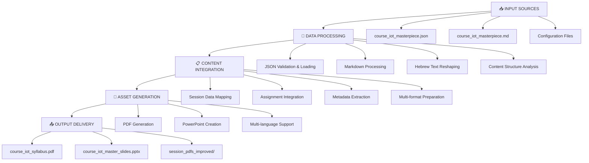
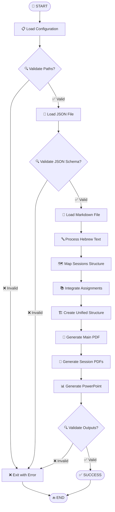
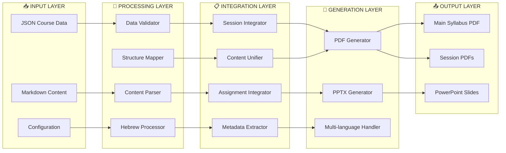
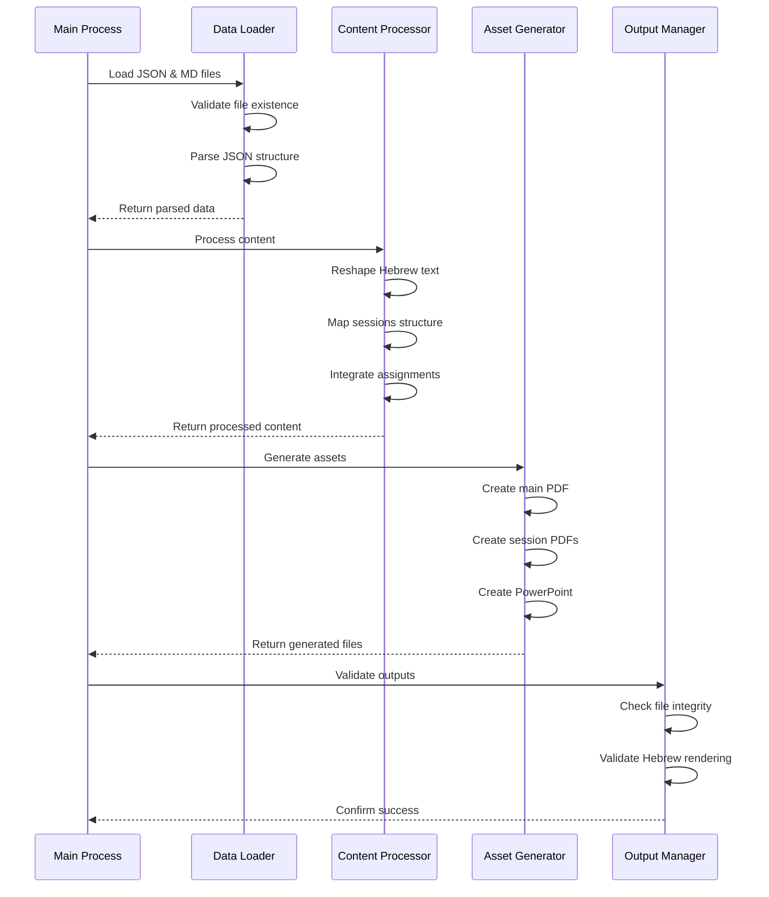
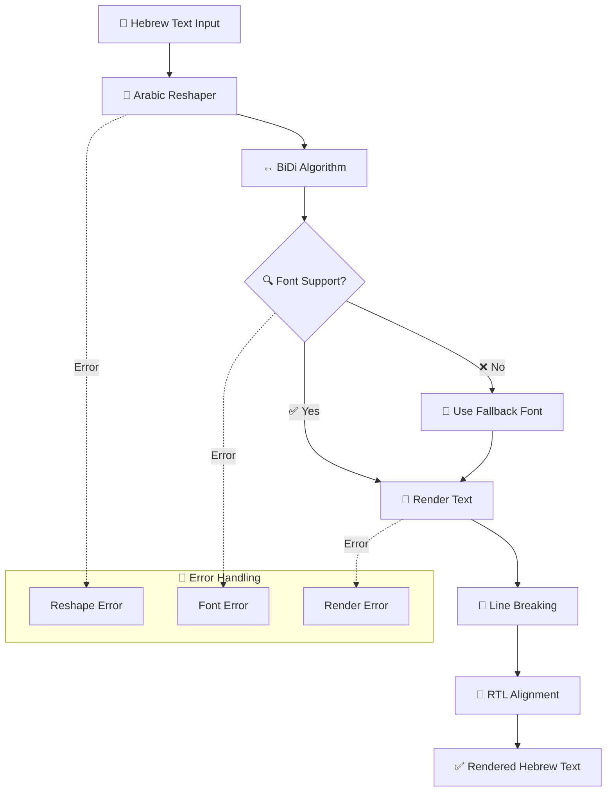
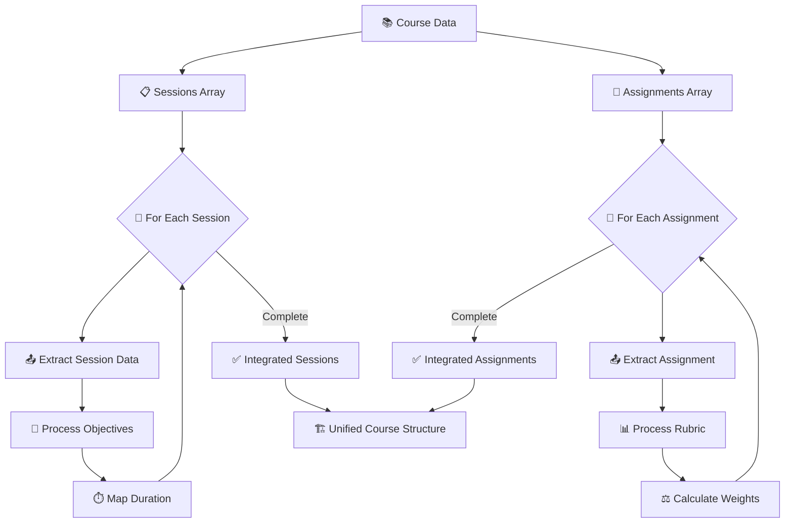
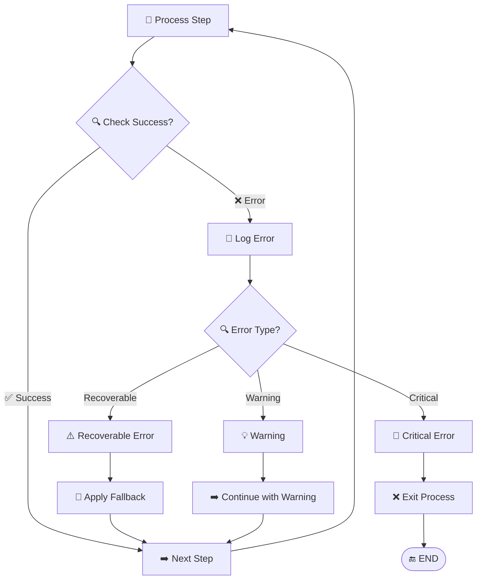
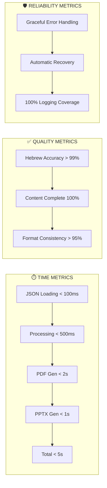

# תרשים זרימה ויזואלי - מנגנון יצירת קורס

## 🎯 תרשים זרימה ראשי (Mermaid)

## 🔄 תרשים זרימה מפורט

## 🧩 תרשים ארכיטקטורה מפורט

## 🔀 תרשים זרימת נתונים

## 🎛️ תרשים מורכבות עיבוד עברית

## 📊 תרשים ניהול מטלות ומפגשים

## 🔧 תרשים טיפול בשגיאות

## 📈 תרשים מדדי ביצועים

---

## 🎯 סיכום התרשימים

התרשימים מציגים:

1. **זרימה ראשית** - מקבלת נתונים ועד פלט מוגמר
2. **ארכיטקטורה מפורטת** - שכבות המערכת והקשרים ביניהן  
3. **זרימת נתונים** - רצף פעולות בין רכיבי המערכת
4. **עיבוד עברית** - המורכבות הייחודית של טיפול בטקסט עברי
5. **ניהול תוכן** - איך המערכת מטפלת במפגשים ומטלות
6. **טיפול בשגיאות** - מנגנוני התאוששות ובקרת איכות
7. **מדדי ביצועים** - מעקב אחר יעילות המערכת

המערכת מתוכננת להיות עמידה, יעילה ומדויקת בטיפול בתוכן עברי מורכב.